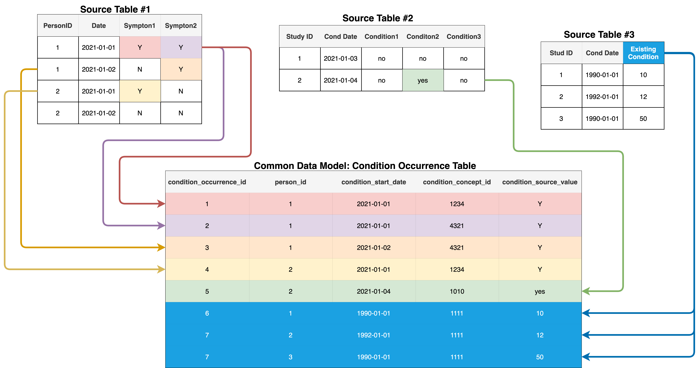

Welcome to our repo for `python` tools used by/with the CaRROT project. The primary functionality is used for performing ETL on health datasets, converting them to the OHDSI Common Data Model (CDM), via a command line interface.

CaRROT-CDM contains a pythonic version[^1] of the OHDSI CDM, implemented via the class `CommonDataModel`. CDM tables, such as "Person" are defined as classes (e.g. [`Person`](Person.md)) within the code base. 

[^1]: In the default setup a __slightly__ (`visit_detail_id` link has been removed from Measurement, Observation and Condition Occurrence tables) modified CDM version [`5.3.1`](https://github.com/OHDSI/CommonDataModel/releases/tag/v5.3.1) is used to define a subset of tables in python.

The primary purpose of the CaRROT-CDM package is to {==Extract==} input datasets and {==Transform==} them using __mapping rules__ defined in a json file, outputting formatted datasets in `tsv` format that can be {==Loaded==} into a database or other destination ({==ETL==}).

## Getting Started

To get started with the [ETL](ETL/About.md) process, follow the instructions for installing the CaRROT-CDM package and running the ETL on the following pages:

!!! success "ETL"
    1. [Frequently Asked Questions](FAQ.md)  
    1. [Installing](Installing.md)  
    1. [About the ETL Process](ETL/About.md)
    1. [Guide](ETL/ETL-Guide.md)  
	    1. [Configuration](ETL/Yaml.md)
        1. [Extract](ETL/Extract.md)
        1. [Transform](ETL/Transform.md)
        1. [Load](ETL/Load.md)
    
    
## Guides

More detailed guides and documentation for users and developers can be found in the following locations:

[User Guide](Installing.md){ .md-button .md-button--primary}
[Developer Guide](CommonDataModel.md){ .md-button .md-button--secondary }

