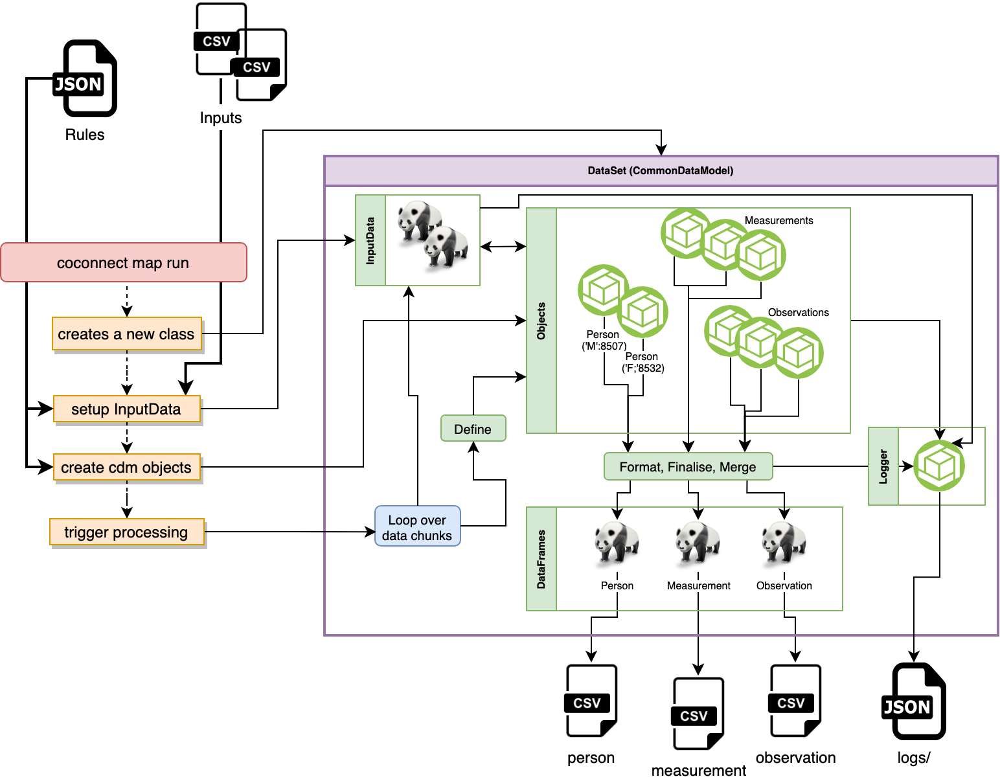

The CaRROT ETL process runs via a Command Line Interface, installed with the co-connect-tools package.


In the context of the CaRROT workflow {++ETL++} stands for (and means):

* {++Extract++}: input data is extracted into `.csv` format and (optionally) pseudonymised    
* {++Transform++}: a CDM model is created and processed, given the extracted data and a [`json` transformation rules file](/docs/CoConnectTools/ETL/Rules/) which tells the software how to map (transform) the data.    
* {++Load++}: inserts the data into a database or other destination.

## Workflow

Our {++ETL++} workflow is provided in the form of the so-called __ETL-Tool__ which is a command line interface (CLI):
```
coconnect etl --help
```
```
Usage: coconnect etl [OPTIONS] COMMAND [ARGS]...

  Command group for running the full ETL of a dataset

Options:
  --config, --config-file TEXT  specify a yaml configuration file
  -d, --daemon                  run the ETL as a daemon process
  -l, --log-file TEXT           specify the log file to write to
  --help                        Show this message and exit.
```

This is an automated tool, meaning it is able to run (optionally as a background process) and detect changes in the inputs or configuration files to process new data dumps. 

Currently, automation using the `coconnect etl` CLI is possible for loading to a BC-Link or outputing to a local file storage system.


### CaRROT--BC-LINK Workflow

The whole point in transforming data into the OMOP CDM format is so the data can be uploaded to BC-Link. This workflow can be performed in one step with the correct configuration of the input `yaml` file when running `coconnect etl --config <yaml file>`, see:
<center>
[Configuring the Yaml File](/docs/CaRROT-CDM/ETL/Yaml/){ .md-button .md-button--primary}
</center>

However, the process may need to be decoupled into multiple steps; for example, if BC-Link is not hosted on a machine that has access to the original data. In this scenario the `coconnect etl` or `coconnect run map` can be used to perform the transform (OMOP mapping), the output files can then be transfered to the machine hosting BC-Link and be uploaded (from the command-line, or using the BC-Link GUI)


### Architecture Overview
A schematic diagram of the CaRROT/bclink ETL is given below:



{== The following breaks down what each part of the process is doing... ==}

### Extract
* Formats the input data to abide by the [co-connect data-standards](https://co-connect.ac.uk/co-connect-data-files-and-meta-data-standardisation/) **[manual]**
* Creates data-dumps of the input datasets in the form of `csv` files for each dataset table. **[manual]**
* Pseudonymises the input datasets, masking any person identifiers or person IDs **[optionally automated]**

### Transform
* The transform mapping is executed with the command `coconnect run map [arguments]`, where additional arguments pass the paths to a mapping-rules [`json` file](/docs/CaRROT-CDM/ETL/Rules/) and input data `csv` files **[optionally automated]**:

    * A new pythonic [`CommonDataModel`](/docs/CaRROT-CDM/CommonDataModel/) is created.   
    * [`DataCollection`](/docs/CaRROT-CDM/DataCollection/) is created to handle/chunk the input files and is added to the `CommonDataModel`.  
    * The mapping-rules `json` is used to create new [CDM Tables](/docs/CaRROT-CDM/Common/#coconnect.cdm.objects.common.DestinationTable) (e.g. [Person](/docs/CaRROT-CDM/Person/)).
        * For each CDM Table, multiple tables can be created. E.g. there may be multiple [Condition Occurrences](/docs/CaRROT-CDM/ConditionOccurrences/) defined across multiple input data files and columns (fields).  
        * The rules `json` encodes so-called "term-mapping" - how to map raw values into OHDSI concept IDs for the output. These are setup as lambda functions and passed to the object's [`define` function](/docs/CaRROT-CDM/Common/#coconnect.cdm.objects.common.DestinationTable.define)  
    * [Processing](/docs/CaRROT-CDM/CommonDataModel/#coconnect.cdm.model.CommonDataModel.process) of the `CommonDataModel` is triggered:   
        * **[optionally chunked]** A new chunk of `DataCollection` is grabbed.   
        * Each CDM table is looped over:  
            * All objects of this CDM table are found and looped over:
                 * The `define` function is called to apply the rules.
                 * A new dataframe is retrieved for the object.
	    * All retrieved dataframes are merged.   
	    * The merged dataframe is has a formatting check applied
	    * The merged dataframe primary keys are correctly indexed
	    * The final dataframe is saved/appended to an output `tsv` file.   
        * This is repeated until all chunks are processed.   

### Loads
   * Uploads the output `tsv` files into the bclink job-queue which formats and uploads these into the bclink database **[optionally automated]**

