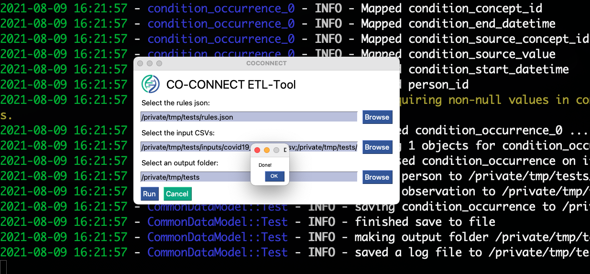

!!! caution
    On macOS the GUI only works with `python >= 3.9.0`

A simple Graphical User Interface (GUI) is implemented in co-connect-tools in order to run the mapping.


## 1. Prepare the inputs

In this example, we use the test data that is available in the tool (see `coconnect info `)
We have:  

* A `rules.json` file for the mapping-rules  
* A folder containing the input data  


## 2. Start the GUI

Assuming you have successfully installed the packaged, you need to enter the command line to start the GUI:

=== "Option 1" 
    ```
    etl-gui
    ```
=== "Option 2" 
    ```
    coconnect map gui
    ```
!!! note
    This can be started from any directory, as soon as you open up the command line. You do not need to be in the same directory as all your files.


Which pops open the GUI..


## 3. Select Files

Use the browse buttons to select the rules.json file as well as the input `.csv` files


## 4. Run

Click the "Run" button to execute running the tools on the selected files. 


## 5. Inspect the output

You will see outputs appear on the command line. A pop-up box will appear saying 'Done' when the tool has finished running.


Now the folder will contain the output `tsv` files which contain the mapped CDM tables. In this example these are:  

* `person.tsv`  
* `condition_occurrence.tsv`  
* `observation.tsv`  


