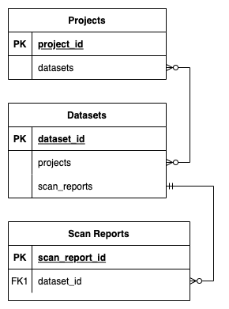

# Projects, Datasets, and Scan Reports

The system makes use of a 3-level hierarchy of objects to organise data and facilitate easy 
administration of granular user access controls. These are `Project`s, `Dataset`s, and 
`Scan Report`s.

A `Project` is the highest-level object. A single `Dataset` may live in more than one `Project`.
`Project`s are the simplest way to administrate access to `Datasets`, because a user can only
have access to a `Dataset` if they are a member of at least one of the `Project`s containing 
the `Dataset`.

A `Dataset` is owned by a single `Data Partner`, and contains a number of `Scan Reports`.
Each `Scan Report` corresponds to a single scan report file generated by White Rabbit or a 
similar tool.

A `Scan Report` lives within a single `Dataset`.

The below diagram is a simple illustration of the relationships. A `Scan Report` sits within a 
single `Dataset`, which may contain many `Scan Reports`. `Dataset`s and `Project`s exist in a 
many-to-many relationship.

# Access controls

There are 3 levels of protection between a user and data. These are

1. `Project` membership
2. `Dataset` visibility and roles
3. `Scan Report` visibility and roles

The following are the rules for access. For a user to be able to see a `Dataset` or `Scan Report`,

1. they must be a `member` of at least one `Project` in which the `Dataset` 
(or the `Scan Report`'s parent `Dataset`) sits.
3. the `Dataset` must be `PUBLIC`, or they must be an `admin`/`editor`/`viewer` of the `Dataset`.
4. To see the contents of the `Scan Report`, in addition, the `Scan Report` must be `PUBLIC`, or
they must be an `author`/`editor`/`viewer` of the `Scan Report`.

## Scan Report roles
### `Viewers`

`viewers` of a `Scan Report` can perform read-only actions:

- view `Scan Report` contents
- view `Scan Report` details including `editors`, `author`, etc
- regenerate and download mapping rule list

### `Editors`

`editors` of a `Scan Report` can additionally 

- add/remove concepts
- set PersonID and DataEvent on tables
- set `is ignore` and `Pass from source` flags, and set description columns, on fields

### `Authors`

The `author` of a `Scan Report` can additionally

- administrate access to the `Scan Report`
- edit name and visibility
- change parent `Dataset`

## Permissions inheritance between `Dataset`s and `Scan Report`s

`editors/admins` of a `Dataset` inherit `editor/author` access respectively to all `Scan Report`s in the `Dataset`.

`Dataset` access is explained in more detail in this diagram:

`Scan Report` access is explained in further detail in this diagram:

