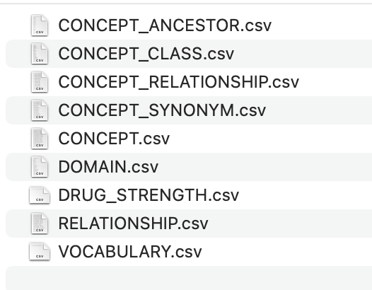

# Adding a new vocabulary to the database

The `omop.vocabulary` table holds the recognised vocabularies for use in automated mapping. 

To add a new vocabulary to the database, 3 tables need updating: `omop.vocabulary`, `omop.concept` and `omop.concept_relationship`.

Download the required files from Athena, which should give a file structure like this:

The only required fiels are `CONCEPT_RELATIONSHIP.csv`, `CONCEPT.csv` and `VOCABULARY.csv`.

Open the `VOCABULARY.csv` file (better to use a text editor than Excel, which will often reformat the file unhelpfully),
and remove everything except the header and the line for the required vocabulary, then save the file.

In PGAdmin, right-click on the `omop.vocabulary` table > Import/Export Data. Set the Import/Export toggle to "Import",
and select the `VOCABULARY.csv` file. Set Header to "Yes", Delimiter to "Tab", then press OK. The import should proceed successfully.
Check for success by querying the table contents.

Open the `CONCEPT.csv`, and remove all lines which do not relate to the given vocabulary - check the `vocabulary_id` column.
Import this file in the same way to the `omop.concepts` table.

Finally, import `CONCEPT_RELATIONSHIP.csv` to `omop.concept_relationship` in the same way - the file may require editing, 
as it may contain duplicate entries already present in the database, which will cause the import to fail. the only
rows required are those which relate to concepts present in `CONCEPT.csv`. Ideally, an UPSERT script should be used for 
this import, though one is not available at the time of writing.

