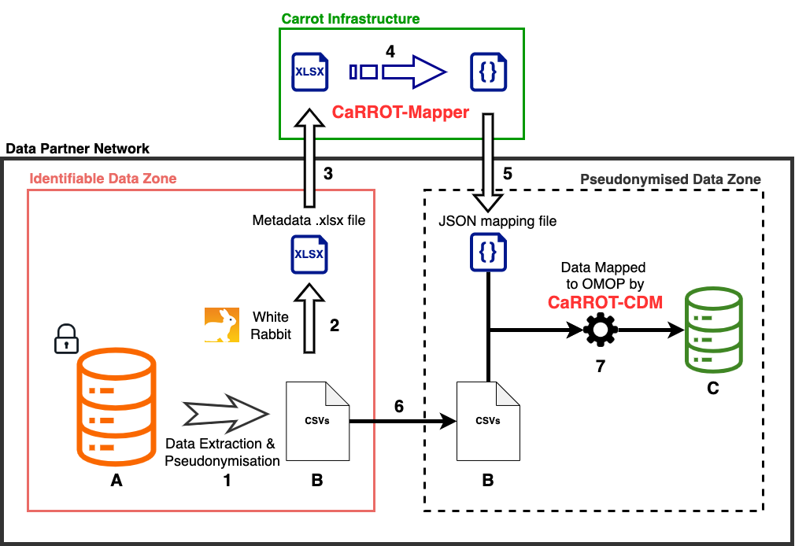

# Carrot-Mapper

[Carrot-Mapper](https://github.com/Health-Informatics-UoN/CaRROT-Mapper) is a webapp which allows the user 
to use the metadata (as output by WhiteRabbit) from a dataset to produce mapping rules to the OMOP standard, in the
JSON format. These can be ingested by [CaRROT-CDM](https://github.com/HDRUK/CaRROT-CDM) to perform the
mapping of the contents of the dataset to OMOP.

Carrot-Mapper provides automated mapping from a selection of vocabularies, reuse of mapping
rules across datasets, and manual mapping rule generation.

Carrot-Mapper also provides a number of helpful features to support and encourage 
standardised mappings across datasets.

Carrot-Mapper is built using Python, Django and React, with a PostgreSQL database,
and is hosted in Azure using Azure App Services, Azure Database for PostgreSQL, 
and Azure Functions.

