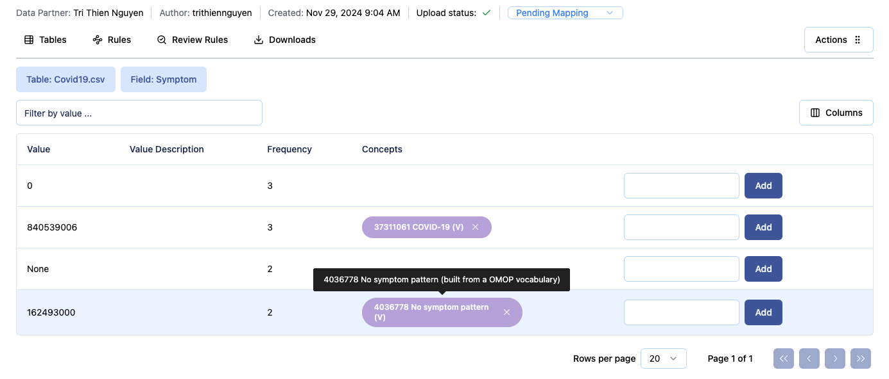

# Quickstart Guide

!!! warning
    This page is a work in progress, and should not be relied upon.

This Quickstart guide will guide you through the usage of Carrot-Mapper. Specifically, it covers:

1. [Home page](#home-page)
2. [Gaining access](#gaining-access)
3. [Uploading a first Scan Report](#uploading-a-first-scan-report)
4. [Navigating within a Scan Report](#navigation)
5. [Creating Mapping Rules](#creating-mapping-rules)
6. [Downloading Mapping Rules](#downloading-mapping-rules)
   <!-- Not sure the below sections are needed in the quickstart, commenting for now  -->
   <!-- 7. Understanding Datasets and Projects -->
   <!-- 8. Administrating Datasets and Scan Reports -->
   <!-- 9. Managing Project access -->
   <!-- 10. Analysing Mapping Rules -->
   <!-- 11. Getting help -->

This Quickstart guide is intended as a brief introduction to each of the areas.
Users requiring more details should follow the links or search the documentation for their specific query.
Developers should use the Developer Guide for technical documentation.

## Home Page

This [page](https://carrot.ac.uk) provides some basic introduction and information about Carrot, its functionality and its funders.

From here you can login to start using Carrot, access its GitHub repo or start a discussion about anything related to Carot.

## Gaining Access

The deployed Carrot-Mapper is available at [carrot.ac.uk](https://carrot.ac.uk).

A user account is required to access the site; one can be requested from the site administrator.

Users must be a member of at least one Project.
Project membership is currently handled by the site administrator.

Once logged in, the user is presented with the Scan Reports page. This page includes the list of Scan report the user has the permission to view or edit.

## Uploading a first Scan Report

To begin, navigate to "Upload Scan Report" using the navbar at the top of the screen.

You can look for samples of a Scan report and a Data dictionary in the `samples` folder of this repo.

Fill in the details as required, and upload a valid Scan Report File.
You may optionally provide a Data Dictionary file.
If an error message occurs, fix the error in the Scan Report File (or Data Dictionary file if provided) and try again to upload.

!!! caution
    Not all possible errors in the files can be checked before upload. If you are directed to the Scan Reports page after upload, this indicates that all pre-checks have completed.
    However, other errors can be checked only during the processing of the file after upload. If these occur, the `Upload Status` of the Scan Report may change to `Upload Failed`, or it may stay as `Upload in Progress` forever (over 30 minutes indicates an error).
    If this occurs, please check your files yourself for possible errors, and if that fails then contact the system administrator to check the logs.

Once a valid Scan Report File is uploaded, the user will be redirected to the Scan Report list page.
This should show the newly created Scan Report at the top of the table.

After upload, an automated task is launched to ingest the contents of the file and perform a number of processing steps.
This process can take several minutes for large Scan Report Files.
While this process is running, the "Upload Status" visible to the right of the row will be "Upload in Progress".
Once the process completes, the status will change (once the page is reloaded) to "Upload Complete".
In the case of an unrecoverable error in processing, the status will be set to "Upload Failed".

!!! Caution
    Please note that sometimes errors in processing do not result in the status being set to "Upload Failed", with the status incorrectly remaining as "Upload in Progress".
    If this status remains for more than 30 minutes then you can be sure that the process has failed.
    Please report this to the development team with a copy of the Scan Report File being used, to help us improve the checks run.

Wait for approximately one minute to ensure the example Scan Report has been fully processed.
Refresh the Scan Reports page to check that the Status of your Scan Report has been set to "Upload Complete" before continuing.

## Navigation

After upload, the user is directed to the Scan Reports page before the new Scan Report has been fully processed.
While the Scan Report continues to be processed, the contents visible on Carrot-Mapper will be populated over time.

Click on the name of the Scan Report to navigate to the list of Tables ("Tables List") within the Scan Report.
As Tables are processed, the user can click on the name of each Table to navigate to the list of Fields ("Field List") within that Table.
Similarly, clicking on a Field name in a Table will display the list of Values ("Value List") within that Field.
In this way, the structure of the Scan Report can be navigated.

Sometimes a list is too large to be displayed all at once. In this case, the list will be displayed over a number of pages. Use the blue buttons at the bottom of the page to navigate through the pages.

Use the breadcrumbs at the top of the page to quickly navigate back up the Scan Report or its parent Dataset. You can also use tabs `Tables`, `Rules`, `Review Rules`, `Downloads` to navigate between these pages and functionalities of the current Scan Report.

## Creating Mapping Rules

The example Scan Report and Data Dictionary will have added some OMOP Concepts to fields and values in the Scan Report.

You can hover over the Concepts to show more details about them (currently this just shows further details of how the Concept was added - in the case of the example below, they are added by vocab as defined in the Data Dictionary we supplied).

### Setting Person ID and Date Event for each table

The first task of creating Mapping Rules for a Scan Report is to set the Person ID and Date Event fields of each table.

Navigate to the Tables view of your Scan Report by clicking on its name on the Scan Report list page.
This page will show the list of all the tables in the Scan Report, while the `PERSON ID` and `EVENT DATE` columns are empty.
On the right-hand side, press the `Edit Table` link on the first table (`Demographics.csv`).
In the first drop-down (Person ID), select `PersonID` which is one of the fields as reported by the Scan Report file.
In the second drop-down (Date Event), select `Date_of_Birth`.
Then press the `Save` button.
You will be taken back to the Tables list, and the `PERSON ID` and `EVENT DATE` columns are now populated in the `Demographics.csv` row.

The `Job Progress` indication for this table should now be `In Progress`. You can click this indication for more information about the creating mapping rules jobs which are running in the background.

!!! note
    While creating mapping rules jobs of one table are running, you cannot set `PersonID` and `Date` of other tables in the same Scan Report.

Now do the same for `Covid.csv`, selecting `PersonID` and `Date`.

The Tables list will now show both tables have filled `PERSON ID` and `EVENT DATE` columns.

### Generate Initial Mapping Rules

Navigate to the `Rules` page associated to your Scan Report.
This can be done by the `Rules` tab under details of a current Scan Report.

Now that `Person ID` and `Date Event` are set for each of the tables, the Mapping Rules associated to those Concepts are been generated.

When `Job Progress` indication shows `Job Complete` for all the tables, the tables are now populated by the Mapping Rules associated to the Concepts already mapped.

!!! note
    If you see `Not Started or No data yet` when hover over the `Job Progress` indication, this is usually a sign that you have not set the `Person ID` and `Date Event` on the tables. Or you just need to update the table fields again for Carrot to start collecting the data about jobs.

Note that there are 5 or 6 rows in the table associated to each Concept.
This fully describes how to map the source term to the OMOP standard.

A `Review Rules` page is available using the `Review Rules` tab near the top of the page.
This shows only one of the Rules associated to each source-concept pair, which can be useful for reviewing.

All the Mapping Rules associated to the Concepts, which were automatically added to our Scan Report by using a Data Dictionary file, are now available.

### Add further Concepts

Further mappings can be added manually.

Navigate to the `Demographics.csv` table, and the `Sex` field.
There will be a table with 3 rows: `F`, `M` and an empty row.
Note that, thanks to our Data Dictionary file, the `Value description` column has been populated with helpful information.
It indicates that `F` means "Female", and `M` "Male".
To add the correct OMOP Concepts, click in the text box to the left of the `Add` button on the right-hand side of the screen, in the row associated with `F`.
Type `8532` and press `Add`. After a moment, a green `OMOP Concept successfully added.` banner appears, along with a blue Concept tag inside the table.
Similarly, add `8507` for the `M` row.

Now that these Concepts have been added, press the `Rules` tab.
Note that new rows have been added associated to the `F` and `M` values. These were generated at the time of adding the Concepts on the previous page.

You can also try _removing_ a Concept by pressing the grey `x` on the right of any Concept tag, then return to the Rules page to see that the associated Mapping Rules have been deleted.

## Downloading Mapping Rules

The final task in the simplest end-to-end process in Carrot-Mapper is to download the Mapping Rules in a form that can be used as input to Carrot-CDM (which will perform the transformations on the data).

On either `Rules` or `Review Rules` pages, you can see the `Request Download` button on the top-right hand side. Press that and choose either `Mapping JSON` or `Mapping CSV` (more human-readable version, but cannot be used as input to Carrot-CDM) to start the process of generating the chosen file. After requesting successfully, you will be redirected to `Downloads` page. While the file is being genrated you can see an indication for this on the left hand side. The generated file which is ready for downloading will be seen on `Downloads` page, after a few moment.

Finally, a diagram of the Mapping Rules can be viewed using the yellow `View Map Diagram` button. This will take a few minutes to show for large Scan reports.
