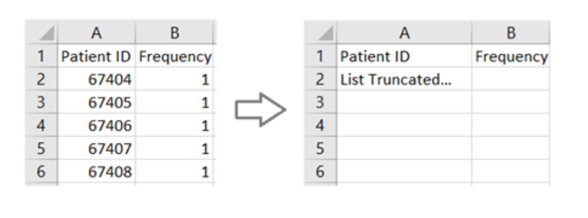

# Data Standards

## Converting to CSV files

Before using White Rabbit to generate a Scan Report File, data must be converted to a set of CSV files. 
This may require some restructuring of the dataset.

The CSV files must fulfil the following:

* One CSV file that represents the demographic data of individuals. This should contain the anonymised ID for the individual (following the CO-CONNECT specification), Sex and Date of Birth (obfuscated as required) as a minimum, and Ethnicity where possible. In cases of multiple demographic records per individual, please include only the most recent record in the demographics file.
* One or more CSV files that contain event data, such as questionnaire responses or clinical events/measurements. As a minimum each CSV file must have a column that contains the anonymised ID for the individual (matching an entry in the CSV file above), the date of a particular event (one per file) and one or more columns that capture the data relevant to that date. You can have as many CSV files as needed, but each CSV file must only contain information effective on the specified event date.
* All measurements in the metric system. 
* All dates and datetimes in the ISO-8601 format: YYYY-MM-DD HH:MM:SS.ffffff
* All numbers without any digit grouping symbols (e.g. 1000, not 1,000). 
* All decimal numbers rounded to two decimal places after the decimal symbol “.”. 
* All CSV files encoded with UTF-8 and Unix/Linux line ending. 
* All CSV file names limited to 30 characters.

## Using White Rabbit

### Minimum count threshold
WhiteRabbit contains an option to automatically remove values with frequency values under a certain threshold, 
for instance if a dataset contains a field called “condition”, and there are only 2 patients with a very rare condition, 
this can cause security concerns. 
Consider whether you should set the “Minimum Cell Count” threshold in WhiteRabbit to avoid identifying information
being included in the Scan Report File.

### Reviewing Scan Report File contents
!!! warning

    Ensure all Scan Report Files are thoroughly reviewed for any identifying information before extracting
    them from their secure location.

Please remove any data values which could be deemed as confidential or sensitive from the scan report, 
such as the anonymised ID of the individual, date of birth, and their frequencies. 

When removing these values and frequencies from the Scan Report, please refrain from removing the entire 
column from the spreadsheet. For instance, please maintain the headers and remove the values, as in the example below:


### IDs and date values
!!! tip

    Note that in almost all scenarios, patient ID (pseudonymised or other) and date values are _not required_
    to be included in the Scan Report File, since they will not be mapped to an OMOP concept.
    These IDs and dates will still be transformed appropriately at the ETL stage without their inclusion in the Scan 
    Report File, so long as their columns are still present as above, and so we advise the column values are removed. 
    This will also speed up the processing of the Scan Report.

## Data Dictionary File
The optionally-supplied Data Dictionary can be used to supply 

1. descriptions of values
2. vocabulary labelling for fields

Please provide this information in one CSV file, with the following columns: 
`csv_file_name`, `field_name`, `code`, and `value`. 
Here is an example to demonstrate the expected format. 

===   "Table view"

    | csv_file_name | field_name | code   | value  | 
    |---------------|------------|--------|--------|
    | questionnaire | gender     | 0      | Male   |
    | questionnaire | gender     | 1      | Female |
    | results       | Q1         | 0      | Fever  |
    | results       | Q1         | 1      | Cough  |
    | results       | Q1         | 2      | Wheeze |
    | results       | Q2         | 0      | Yes    |
    | results       | Q2         | 1      | No     |
    | results       | Q3         | SNOMED |        |
    | results       | Q4         | LOINC  |        |

=== "CSV view"

    ```csv
    csv_file_name,field_name,code,value
    questionnaire,gender,0,Male
    questionnaire,gender,1,Female
    results,Q1,0,Fever
    results,Q1,1,Cough
    results,Q1,2,Wheeze
    results,Q2,0,Yes
    results,Q2,1,No
    results,Q3,SNOMED,
    results,Q4,LOINC,
    ```

!!! tip
    
    The CSV file must have 4 columns.    
    Rows that indicate a vocabulary must still contain an empty column at the end of the row in the csv file.
    In the above, the last two rows contain a comma after the vocabulary name to achieve this.

This will instruct CaRROT-Mapper to perform the following:

1. Rows 1-7 will add Value Descriptions to the CaRROT-Mapper interface at the respective locations.
For example, the first row will ensure the text "Male" is displayed next to the value "0" in the "gender" field in the 
"questionnaire table". This means a human user of the interface can quickly identify the meaning of the value "0",
rather than having to look up the value from the data dictionary themselves. Note that this mechanism *does not* perform any
automated mapping, but is a helpful feature for a human user.
2. Rows 8 and 9 indicate that the 2 fields "Q3" and "Q4" in the "results" table should be automatically mapped
from the supplied vocabulary to the OMOP standard. Any values in this field that CaRROT-Mapper recognises as valid 
codes from the supplied vocabulary will be automatically converted to OMOP.


