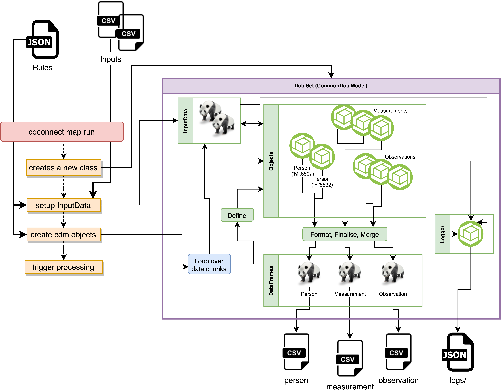

Welcome to our repo for `python` tools used by/with the CO-CONNECT project. The primary functionality is used for performing ETL on health datasets, converting them to the OHDSI Common Data Model (CDM), via a tool referred to as the _ETL Tool_ .

CO-CONNECT-Tools contains a pythonic version of the OHDSI CDM, implemented via the class `CommonDataModel`. CDM tables, such as "Person" are also defined as classes (e.g. [`Person`](/CoConnectTools/Person/)) within the code base. 

!!! note 
    In the default setup a __slightly__ (`visit_detail_id` link has been removed from Measurement, Observation and Condition Occurrence tables) modified CDM version [`5.3.1`](https://github.com/OHDSI/CommonDataModel/releases/tag/v5.3.1) is used to define a subset of tables in python.

The primary purpose of this package is to perform ETL of a dataset based upon a supplied set of transform rules encoded within a json file. [Click here](/CoConnectTools/ETL-Tool/) to jump to a short walkthrough of the steps necessary to run the tool.
The tools is designed to handle the output json of the CO-CONNECT Mapping-Pipeline web-tool known as CCOM.

## ETL-Tool

Our ETL-Tool runs via a Command Line Interface. It defines and processes a CDM model given input data and given a `json` rules file, the latter which tells code how to map and transform the input data. 
 

### Diagram

## Getting Started

To get started, follow the instructions for installing and running the ETL-Tool on the following pages:
### Table of Contents
1. [Installing](/CoConnectTools/Installing/)
1. [Running ETL-CDM](/CoConnectTools/ETL-Tool/)
