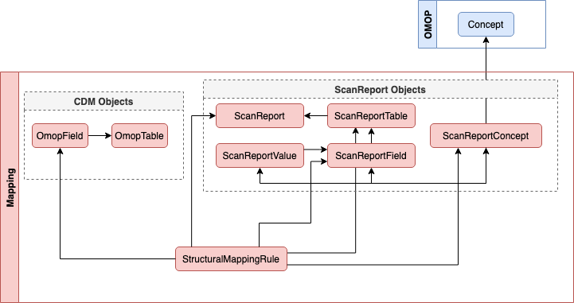

Overview of the data structures and nomenclature 

## Django ORM 

The Django ORM has access to the models displayed in the diagram below, which also illustrates the {++ForeignKey++} or {++GenericRelation++} links between the objects.

All models under the heading "mapping" are available in Postgresql under the `public` schema, e.g. `public.mapping_omopfield`. Whereas models associated with OMOP are available in Postgresql under the `omop` schema e.g. `omop.public`.

### Diagram

### Lookup Table

| Name | Description    | Example(s) | Django Model |
| ----------- | ---- | ------------------------------------ | ------- |
| Destination Field | Output OMOP column/field name in the CDM | `person_id`, `condition_source_value` | `OmopField` |
| Destination Table | Output OMOP table name in the CDM | `person`, `condition_occurrence` | `OmopTable` |
| Source Value | Input value of given row/cell | `M`, `FEMALE`, `YES` | `ScanReportValue` |
| Source Field | Input column/field name | GOSH::sex, GOSH::ethnicity  | `ScanReportField` |
| Source Table | Input table name |  GOSH:: 2_costar. CoConnect_db_serology_ | `ScanReportTable` |
| Source Report | Input Scan Report |  GOSH::CO-STARS | `ScanReport` |
| Term Mapping | Association between a `Concept` and a so-called `content_object` (`ScanReportField` or `ScanReportValue`) |  "M" -> 8507 | `ScanReportConcept` |

