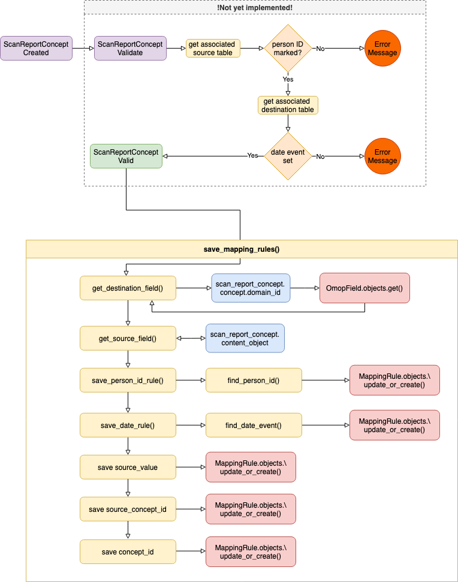

Mapping Rules determine how to link (and potentially modify) between `source_fields` (in
put data) and `destination_fields` (output data) when building `CDM` objects. 

## Prerequisites 

Validation of `ScanReportConcept` occurs when they themselves are created. Their creation will fail if:

1. The associated `ScanReportTable` does not have a `person_id` marked.  
1. The associated `ScanReportTable` does not have a `date_event` marked.

These are requirements for building the mapping rules

## Building Rules

For each `ScanReportConcept` that is created, the procedure to build Mapping-Rules proceeds as follows:

1. The {++destination_field++} (`OmopField` object) of the `<domain>_concept_id` is found using `ScanReportConcept.concept.domain_id`. The {++destination_table++} is linked to the object.

1. From the {++source_field++} or {++source_value++} of the `ScanReportConcept.content_type` the {++source_table++} is found.  

1. At least {== five ==} common mapping rules are first created:

### 1. Person ID
  Is created for the `destination_field` of the (already found) `destination_table`:
  
   *  Every `CDM` object contains a `person_id`  
   *  The rule is built with the current `source_table` and `source_value` or `source_field`, as well as with the `concept`, linking it to the `destination_table`.  


### 2. Date Events
At least one date based `destination_field` of the associated `destination_table` is created:

   * Every `CDM` object must contain at least one `date_event`    
   * They are determined by the global variable `m_date_field_mapper` which is defined in `services_rules.py`:      
```python
m_date_field_mapper = {
    'person': ['birth_datetime'],
    'condition_occurrence': ['condition_start_datetime','condition_end_datetime'],
    'measurement':['measurement_datetime'],
    'observation':['observation_datetime']
}
```
   * As can be seen, most CDM objects have one date event, however `condition_occurrence` is an example where two date events are/were needed
!!! info
    This was a request from the data-team to also map `condition_end_datetime`, with the current implementation, the `condition_start_datetime == condition_end_datetime `.
!!! attention
    OHDSI/OMOP say the standard is to set `condition_end_datetime = condition_start_datetime + 30 days`
    Previously this was handled automatically by the ETL-Tool, and via `operations`, which is now no-longer used.


  *  The rule is built with the current `source_table` from the `content_object` (`source_value` or `source_field`), as well as with the `concept`, linking it to the `destination_table`.

### 3. Source Value

   * A rule is created by finding the `<domain>_source_value` (`OmopField`) for the current `destination_table`. As with previous rules, the rule links this with the `concept` and the `source_table` and `source_field`.

!!! attention 
    This rule could be duplicated for the `destination_field` called `value_as_number` (or `value_as_float`). This appears in `measurement` and is a clone of `source_value`, with a different output format (FLOAT instead of CHAR). Formatting of rules is handled by the ETL-Tool, and therefore from the mapping-pipeline point of view, these rules are the same.

### 4. Concept ID

   * A rule is created by finding the `<domain>_concept_id` (`OmopField`) for the current `destination_table`. As with previous rules, the rule links this with the `concept` and the `source_table` and `source_field`.


### 5. Source Concept ID

   * A rule is created by finding the `<domain>_source_concept_id` (`OmopField`) for the current `destination_table`. As with previous rules, the rule links this with the `concept` and the `source_table` and `source_field`.

!!! attention
    In the current implementation and validation, we force all concept IDs to be Standard. This means that always `<domain>_source_concept_id == <domain>_concept_id`. We may need to review this for the future and allow a `source_concept` and aswell as a `concept` object to be saved to a `ScanReportConcept`. The logic could be that if a `source_concept` is not `null` then `<domain>_source_concept_id != <domain>_concept_id`, which would not affect exisiting `ScanReportConcept` objects that are in the current database.


### Schematic Diagram


## Downloading Rules